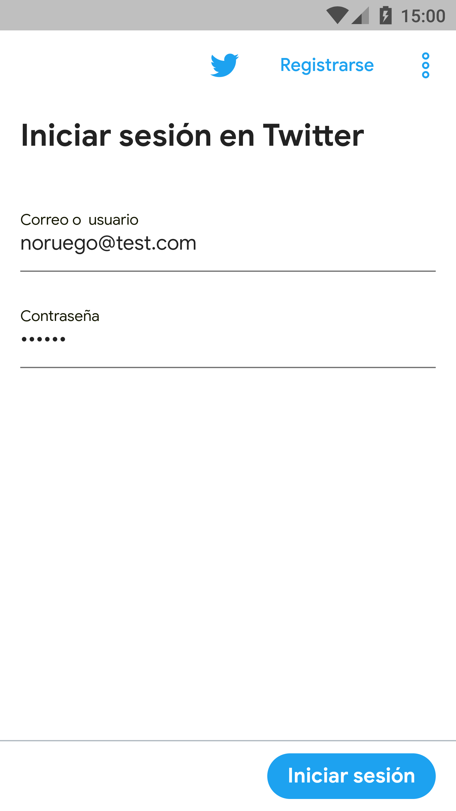
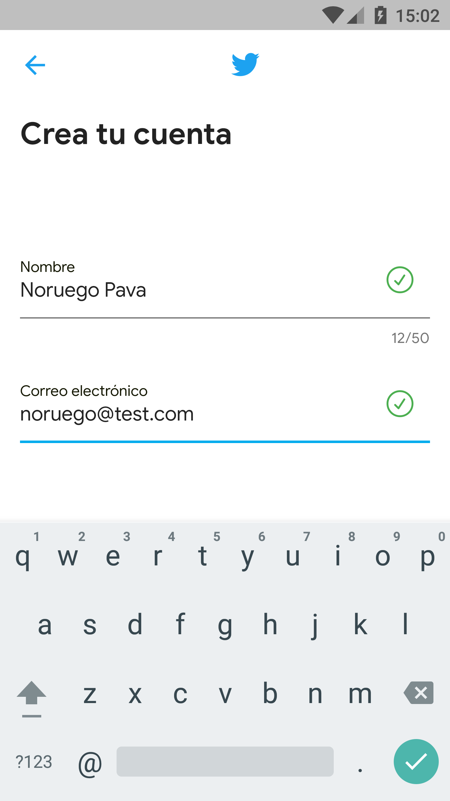
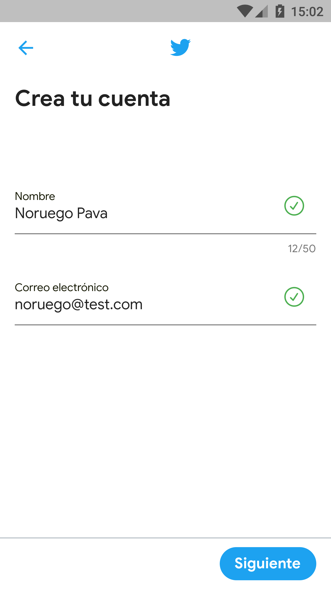
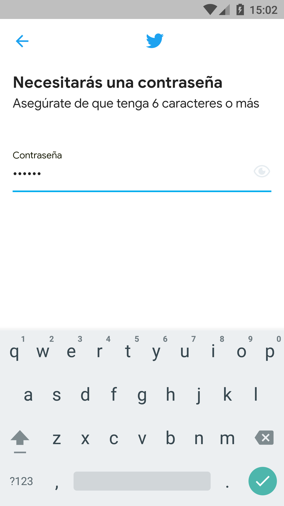
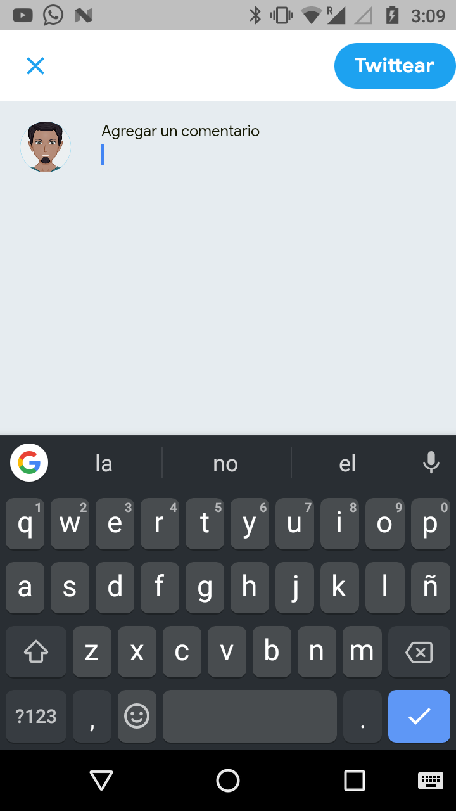
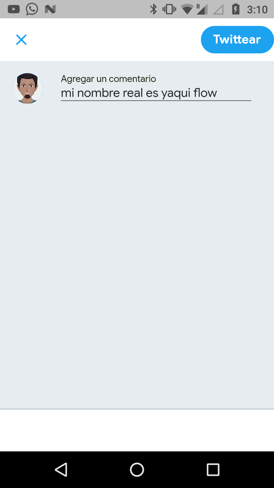
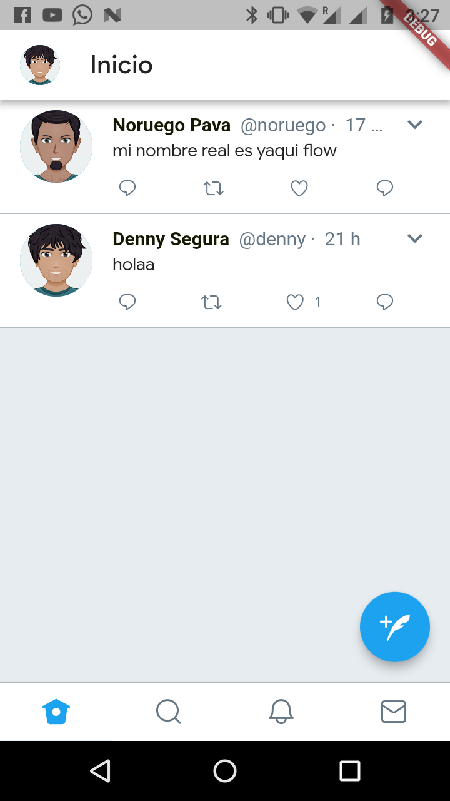
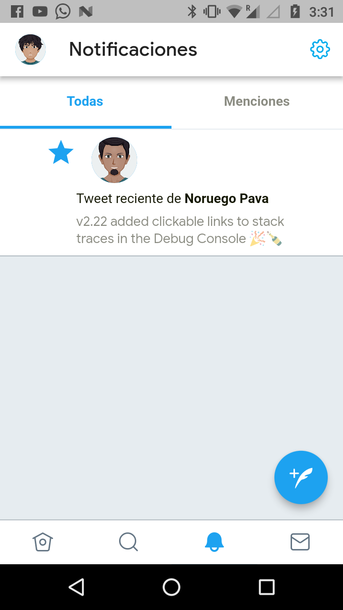
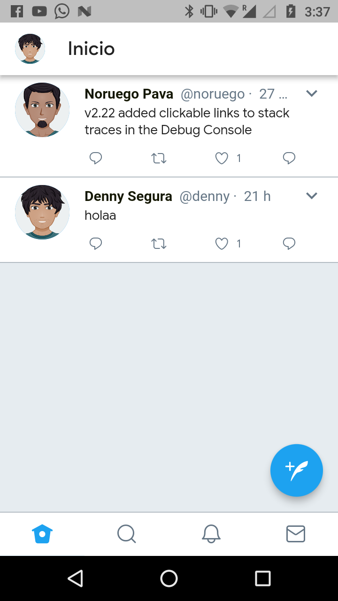

Flutter App with the same style as Twitter for Android and iOS.

    
    
    
    

    
    
    
    

    
    
    
    

    
    
    
    

## Server

[Twitter Flutter NodeJS & MongoDB](https://github.com/EQuimper/twitter-clone-with-graphql-reactnative/tree/master/server)
  
Server credits to [Emanuel Quimper](https://github.com/EQuimper).

## Installation

    $ clone this repo
    $ Install flutter dependencies
    $ Run NodeJS
    $ Change host String on `src/helpers/config/host.dart`
    $ flutter run

Thanks
------

**Denny Segura** © 2018+, Released under the [MIT License]. 

> GitHub [@devdennysegura](https://github.com/devdennysegura) &nbsp;&middot;&nbsp;
> Twitter [@dennysegura3](https://twitter.com/dennysegura3)

[MIT License]: http://mit-license.org/